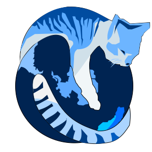

# Simple game engine

## Overview

**Simple game engine** is the library for **game development** on **C++**. The engine designed with love. For people who love make games and people who love play games.

> ## Note
> This is a **educational project**. If you have some comments fell free to contact me.
> antonsyski@gmail.com

### Engine abilities

For now library have next abilities.
- draw privitive shapes
    - adding your own shader
    - sadding your own 2d or 3d model
- interact with OS and read events

### Code exaple

code:

    std::unique_ptr<engine::engine, void (*)(engine::engine*)> engine(
        engine::create_engine(), engine::destroy_engine);

    uint32_t h = 480;
    uint32_t w = 640;

    engine->init(w, h);

## Build

Beore build **SGE**  be shure to having next tools:
- C++ compiler
    - gcc
    - clang
    - or etc. 
- CMake
    - make
    - ninja
    - or etc.

Clone repo and buid

    git clone git@github.com:antonsuski/simple_game_engine.git

